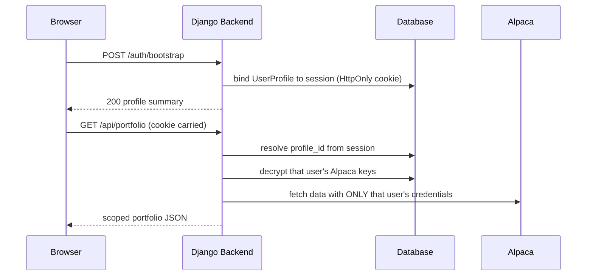
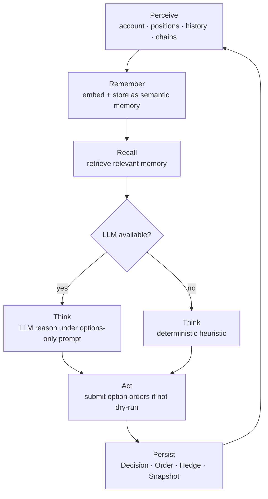

# 🌸 Bloom Trading Agent

An autonomous, **options-only** trading agent backed by a real Alpaca paper account — with silent per-user authentication, semantic memory, and a dual interface (Vue dashboard + Node CLI). It perceives live market data, reasons over a deterministic risk model (optionally LLM-assisted), and records every decision for audit.

> **Live demo**: *[replace with your Vercel URL](https://your-app.vercel.app)*
>
> **Docs / OpenAPI**: served at `/api/docs` by the running backend.

---

## ✨ Highlights

- 🌱 **Options-only mandate** — protective puts, covered calls, cash-secured puts, and vertical spreads. No naked directional bets.
- 🔐 **Per-user isolation** — cookie-based silent auth binds each browser session to its own Alpaca keys; two judges never share credentials or positions.
- 🧠 **Semantic memory** — perceived market facts are embedded and stored (Chroma locally, pgvector in production) and recalled to inform decisions.
- 🧠🔄 **Resilient inference** — Fireworks AI is the primary LLM/embedding provider, with **automatic failover to Featherless**; falls back to a deterministic heuristic if no provider is reachable.
- 🖥️ **Dual interface** — a read-heavy Vue dashboard plus an action-heavy CLI for deterministic operations.
- 🚨 **Emergency controls** — flatten the book, cancel orders, close a position, or buy a protective put from the dashboard with a two-step confirm guard.

---

## 🏗️ Architecture

### System overview

```mermaid
flowchart LR
    U[Browser<br/>Vue + Pinia] -->|fetch /api| V[Vite dev proxy]
    C[Node CLI] -->|fetch /api| B
    V -->|same-origin| B[Django Ninja API<br/>:8000]
    B --> S[(Postgres / Neon<br/>pgvector)]
    B --> A[Alpaca]<br/>paper account
    B --> P1[Fireworks<br/>primary]
    B --> P2[Featherless<br/>fallback]
    B --> G[Chroma<br/>local vector store]
```

### One request, per-user isolation



### Agent decision loop



---

## ⚡ Quick Start

> You need: **Python 3.11+**, **Node.js ≥ 22**, and an [Alpaca](https://alpaca.markets) **paper** API key.

### 1. Backend

```bash
cd backend
python -m venv .venv
# activate:  .venv\Scripts\Activate   (Windows)  |  source .venv/bin/activate  (macOS/Linux)
pip install -r requirements.txt
python manage.py migrate
python manage.py runserver
```

The API is now at `http://localhost:8000/api` (Swagger at `http://localhost:8000/api/docs`).

### 2. Frontend (dashboard)

```bash
cd frontend
npm install
npm run dev
```

Open **http://localhost:5173** — the Vite dev server proxies `/api` to the backend, so the HttpOnly session cookie flows without CORS.

### 3. CLI (optional)

```bash
cd frontend/cli
npm install
npm start -- --help        # or: node bin/trade-cli.js
```

---

## 📂 Project Structure

```
TradeApp/
├── backend/                      # Django + Django Ninja API
│   ├── agent/
│   │   ├── brain.py              # decision loop: perceive→think→act→persist
│   │   ├── data_perception.py    # Perceive: Alpaca data → isolated SDK clients
│   │   ├── mcp_client.py         # thin MCP client over the alpaca-mcp-server
│   │   ├── models.py             # Decision, OrderRecord, Hedge, Snapshot, Embeddings
│   │   └── cli_runner.py         # deterministic emergency executor
│   ├── api/
│   │   ├── routes.py             # all Ninja endpoints (/portfolio, /agent/cycle, …)
│   │   └── schemas.py            # request/response schemas
│   ├── config/
│   │   └── settings.py           # Django settings + dynamic DB gateway
│   ├── user/
│   │   ├── models.py             # UserProfile + encrypted Alpaca keys
│   │   ├── credentials.py        # per-user credential resolution
│   │   ├── decorators.py         # require_auth / optional_auth
│   │   └── tests.py              # auth + per-user isolation tests
│   ├── tools/                    # hardcoded emergency paths
│   ├── .env                      # secrets (gitignored)
│   └── requirements.txt
├── frontend/
│   ├── src/
│   │   ├── views/                # dashboard pages (Dashboard … Controls)
│   │   ├── stores/               # Pinia stores (portfolio, positions, trades, …)
│   │   ├── components/           # DataTable, StatCard, Sidebar
│   │   ├── api.js                # fetch-based REST client (browser + Node)
│   │   └── router/index.js       # routes
│   ├── cli/                      # standalone Node CLI (trade-* commands)
│   │   └── src/commands/         # status, refresh, run-agent, emergency, …
│   └── vite.config.js
├── docs/
│   └── logo.svg                  # project logo
└── README.md
```

---

## 🖥️ Dashboard Guide

The dashboard is the read-heavy side (the "70%"). It uses **silent cookie auth** — the first page load automatically binds your browser's HttpOnly session to the default profile and pulls its Alpaca data. No login form, no tokens to paste.

> _Screenshot placeholder — add `docs/screenshots/dashboard.png` and reference it here._

| Page | What it shows |
|------|---------------|
| **Dashboard** | Portfolio equity, unrealized P&L, day P&L, position count, recent decisions |
| **Positions** | Open stock positions (qty, avg entry, current, market value, P&L) |
| **Options** | Open option positions (hedges + speculative), color-coded |
| **Trades** | Order history (side, type, qty, fill, status, strategy, hedge flag) |
| **Decisions** | Every agent cycle's decision (action, confidence, summary, degraded) |
| **Hedges** | Active option hedges + coverage-by-underlying summary |
| **Jobs** | Background job statuses (refresh / agent cycle) |
| **Controls** | 🚨 Emergency operations (see below) |

### Running one agent cycle

Click **Run Agent** (wired from the dashboard) or hit the endpoint directly:

```bash
curl -X POST http://localhost:8000/api/agent/cycle \
  -H "Content-Type: application/json" \
  -d '{"dry_run": true}'
```

The cycle defaults to **dry-run** (simulated, no live orders).

### Emergency controls (Controls page)

The **red** "Controls" link opens a safety page any user can operate:

- **🔴 FLATTEN ALL POSITIONS** — two-step confirm guard; cancels all orders and closes the entire book.
- **Cancel all open orders** — leaves positions untouched.
- **Close a position** — liquidate a single symbol.
- **Buy a protective put** — hedge a held position (symbol, shares, floor ratio).

---

## 💻 CLI Guide

The CLI is the deterministic "30% action" side — the operations you execute rather than watch. It targets the same backend at `http://localhost:8000/api`.

```bash
cd frontend/cli
npm start -- <command>   # or: node bin/trade-cli.js <command>
```

| Command | Purpose |
|---------|---------|
| `status` | Agent / account overview |
| `refresh` | Pull live state from the broker |
| `run-agent` | Run one decision cycle (`--no-dry-run` to allow orders, `--heuristic-only` to skip the LLM) |
| `positions` | List open positions |
| `options` | List option positions |
| `trades` | Order history |
| `decisions` | Agent decision history |
| `hedges` | Active hedges |
| `jobs` | Background jobs |
| `emergency flat` | Close the whole book (with confirmation) |
| `emergency cancel-all` | Cancel all open orders |
| `emergency close <symbol>` | Close one position |
| `emergency hedge` | Buy a protective put |

> The CLI reads `API_URL` from `frontend/cli/.env` (defaults to `http://localhost:8000/api`). The backend must be running.

---

## 🌐 API Reference

The backend is a **Django Ninja** API at `http://localhost:8000/api` (Swagger: `/api/docs`, OpenAPI schema: `/api/openapi.json`). Every read/write endpoint is owner-scoped: it resolves the `UserProfile` bound to the request's HttpOnly session cookie and operates **only** on that user's data and Alpaca keys.

### Auth (silent, cookie-based)

| Method | Path | Purpose |
|--------|------|---------|
| `POST` | `/auth/bootstrap` | Provision + bind a profile to this HttpOnly session (optional `slug` targets an admin-created profile; default is the env-seeded profile) |
| `GET` | `/auth/whoami` | Current session's auth status (profile summary, no secrets) |
| `POST` | `/auth/logout` | Forget the bound profile (keeps the session cookie alive) |

### Read endpoints

| Method | Path | Purpose |
|--------|------|---------|
| `GET` | `/portfolio` | Latest `PortfolioSnapshot` (equity, cash, P&L, coverage) |
| `GET` | `/positions` | Open stock positions |
| `GET` | `/options` | Open option positions (`status=open` only) |
| `GET` | `/trades?limit=100` | Order history |
| `GET` | `/decisions?limit=50` | Agent decision history |
| `GET` | `/hedges?limit=100` | Active hedges + coverage |
| `GET` | `/jobs?limit=50` | Background job statuses |
| `GET` | `/jobs/{job_id}` | Single background job by id |

### Broker sync

| Method | Path | Purpose |
|--------|------|---------|
| `POST` | `/refresh` | Pull the user's live account + positions from Alpaca into the tracking tables |

### Agent

| Method | Path | Purpose |
|--------|------|---------|
| `POST` | `/agent/cycle` | Run one decision cycle (body: `{dry_run?, heuristic_only?, run_in_background?}`) — dry-run by default |
| `POST` | `/agent/ingest` | Pull perception and store it as the user's owned semantic memory (body: `{symbols?: []}`) |
| `GET` | `/agent/config` | Effective agent runtime config (env defaults + any per-profile overrides) |
| `PATCH` | `/agent/config` | Persist per-profile overrides (`{dry_run?, auto_open_positions?, max_position_pct?, max_positions?, min_cash_reserve?, reset_to_env?}`) |

### Emergency (hardcoded CLI fallback)

| Method | Path | Purpose |
|--------|------|---------|
| `POST` | `/emergency/cancel-all` | Cancel all open orders (positions untouched) |
| `POST` | `/emergency/flat` | Cancel orders + close the whole book (`{confirm: true}` required) |
| `POST` | `/emergency/close` | Liquidate one symbol (`{symbol}`) |
| `POST` | `/emergency/hedge` | Buy a protective put (`{symbol, shares?, spot?, floor_ratio?}`) |

---

## ⚙️ Configuration

Environment variables live in `backend/.env` (gitignored). Copy the values from `.env` (or create one from this reference) and fill in your real keys.

### Django

| Variable | Default | Purpose |
|----------|---------|---------|
| `DJANGO_SECRET_KEY` | dev default | Signing sessions & encrypted Alpaca keys — **generate a new one in prod** |
| `DJANGO_DEBUG` | `False` | Debug mode; set `True` for local dev |
| `ALLOWED_HOSTS` | *(empty)* | Comma-separated host allow-list (required in production) |
| `TRUSTED_ORIGINS` | *(empty)* | Comma-separated CSRF-trusted origins (prod HTTPS domain) |

### Alpaca (per-account bootstrap)

| Variable | Default | Purpose |
|----------|---------|---------|
| `ALPACA_API_KEY` | — | Primary paper account (used for the default profile) |
| `ALPACA_API_SECRET_KEY` | — | Primary paper account secret |
| `ALPACA_BASE_URL` | `https://paper-api.alpaca.markets` | Broker endpoint |
| `ALPACA_DATA_URL` | `https://data.alpaca.markets` | Market-data endpoint |
| `ALPACA_PAPER_MODE` | `True` | Sandbox-only enforcement |

### Inference (LLM + embeddings)

> Fireworks is primary; Featherless is the automatic fallback. Both are OpenAI-compatible.

| Variable | Default | Purpose |
|----------|---------|---------|
| `FEATHERLESS_API_KEY` | — | Fallback provider key (blank until you can generate one) |
| `FIREWORKS_API_KEY` | — | Primary provider key (LLM + embeddings) |
| `AGENT_LLM_PROVIDER` | `fireworks` | Preferred provider name |
| `AGENT_LLM_MODEL` | `accounts/fireworks/models/deepseek-v4-flash-0731` | LLM model (set per-provider via `FEATHERLESS_LLM_MODEL` / `FIREWORKS_LLM_MODEL` if identifiers differ) |
| `AGENT_LLM_BASE_URL` | *(auto)* | Override LLM base URL |
| `EMBEDDING_MODEL` | per-provider | Embedding model (e.g. `Qwen/Qwen3-Embedding-8B`) |
| `EMBEDDER_BASE_URL` | per-provider | Override embedding base URL |
| `EMBEDDING_DIMENSIONS` | `1536` | Vector dimension (keep in sync with the DB column) |
| `EMBEDDING_FORCE_LOCAL` | *(empty)* | Force offline local embeddings (`sentence-transformers`) instead of a remote provider |

### Database / vector store

| Variable | Default | Purpose |
|----------|---------|---------|
| `DATABASE_URL` | *(empty)* | Postgres connection string (Neon + pgvector) in production; fallback is SQLite |
| `SQLITE_PATH` | `:memory:` | Persist local SQLite to a file |
| `VECTOR_STORE_DIR` | `./vector_store` | Local Chroma directory |

### Agent tuning (optional)

| Variable | Default | Purpose |
|----------|---------|---------|
| `AGENT_DRY_RUN` | `True` | Master safety switch — simulate decisions without submitting real orders |
| `AGENT_HEURISTIC_ONLY` | `True` | Skip the LLM and use the deterministic heuristic fallback |
| `AGENT_MIN_EQUITY` | `1000` | Minimum equity before the agent will hedge |
| `AGENT_MAX_DRAWDOWN` | `0.10` | Drawdown alarm → emergency action |
| `AGENT_TARGET_COVERAGE` | `1.0` | Target hedge-coverage ratio |
| `AGENT_FLOOR` | `0.90` | Protective-put floor ratio |
| `AGENT_PREMIUM_BUDGET` | `0.02` | Max premium budget as a fraction of equity |
| `AGENT_HEDGE_DAYS` | `30` | Days to expiry for new hedges |
| `AGENT_MCP_COMMAND` | *(auto)* | Path to the `alpaca-mcp-server` binary (override auto-discovery) |

> These are **server-side defaults**. Per-profile overrides set from the **Controls** page (`/controls`) → **Agent configuration** card always win over env vars for that user.

### Autonomous position entry

By default the agent only **hedges existing positions** (protective puts, covered calls). To let it open positions on its own, set:

- `AGENT_AUTO_OPEN=1` — master switch for autonomous entry (buy stock / cash-secured puts)
- `AGENT_MAX_POSITION_PCT=0.10` — max % of equity per stock position
- `AGENT_MAX_POSITIONS=5` — max concurrent stock positions
- `AGENT_MIN_CASH_RESERVE=5000` — cash floor the agent must never trade below

> **Easiest path (no editing/restart):** open the **Controls** page (`/controls`) →
> **Agent configuration** card. Toggle **Dry run** and **Auto-open positions**,
> tune the sizing knobs, and hit **Save** — it persists per profile and applies
> to the next cycle. The **Flatten all positions** button is your kill switch.
> The env vars above remain the server-side defaults.

When enabled with an empty book, the agent sizes a buy to `equity × max_position_pct`, uses the spot price to convert to a share count, and submits a market order. Keep **Dry run** on until you trust its decisions — the **Controls** page (`/controls`) is the kill switch with a two-click "FLATTEN ALL POSITIONS" guard.

---

## 🧭 Design Decisions

These choices were deliberate — here's the reasoning.

### Cookie-based silent auth (no JWT, no login form)
A lightweight **HttpOnly `sessionid` cookie** binds a browser to a `UserProfile`. It's simple, XSS-resistant, and removes every auth step from the demo — the dashboard just works on first load. `CsrfViewMiddleware` still protects mutating calls.

### Per-user credential isolation
Every request resolves **only that user's** decrypted Alpaca keys and feeds them into isolated SDK/MCP subprocesses. No shared singletons, no cross-contamination — two judges seeing different accounts is guaranteed, not lucky. Verified by `user/tests.py`.

### Chroma (local) + pgvector (production)
`DATABASE_URL` present → Postgres **pgvector**; absent → SQLite + a local **Chroma** container. The pipeline never hard-fails without a network or keys, and semantic search stays consistent across both.

### OpenAI-compatible API format
Using `langchain_openai` against **Fireworks** (primary) and **Featherless** (fallback) means both providers work with zero client changes — only a base URL and key differ. That portability is what makes automatic failover trivial.

### Automatic provider failover
Providers are tried in preference order at **runtime** for the LLM and at **init** (with a warmup probe) for embeddings. If Fireworks is down, Featherless takes over automatically; if neither works, decisions degrade to a deterministic heuristic.

### Paper-only trading
Every profile is sandboxed (`paper=True`) and the emergency/execution paths refuse to go live. For a hackathon showcase this is the correct safety posture.

### Native `fetch` (no axios)
One hand-rolled client module works in **both** the browser (Vue) and Node (CLI), dropping an entire dependency. The `request()` wrapper covers JSON, CSRF headers, cookies, and error parsing that axios would.

### Utility-first CSS (no scoped styles)
A single global design-token system (`main.css` + `utilities.css`) keeps the read-heavy dashboard consistent and small. Component-scoped styles are added only when a component needs something unique — so far, none do.

---

## 🚀 Deployment

1. Set a strong `DJANGO_SECRET_KEY`, `DJANGO_DEBUG=False`, `ALLOWED_HOSTS`, and `TRUSTED_ORIGINS`.
2. Point `DATABASE_URL` at a Postgres instance (e.g. **Neon** + **pgvector**).
3. Add your **Alpaca paper** keys (use a fresh account for the demo environment).
4. Add `FIREWORKS_API_KEY` (primary); add `FEATHERLESS_API_KEY` later for the automatic fallback.
5. Deploy the backend on **Render / Railway / Fly.io**; mirror the env vars in the platform's secret manager.
6. Serve the built frontend (`npm run build` → `dist/`) on **Vercel / Netlify**, or from Django, and set `VITE_API_URL` to your backend origin.

> **Proxy note:** in dev, Vite proxies `/api` to `localhost:8000`. In production, point `VITE_API_URL` at the deployed backend and ensure cookies are sent (same-origin or `credentials`).

---

## ✅ Testing

### Backend

```bash
cd backend
python manage.py test user agent tools api
```

Covers: silent auth flow, per-user credential isolation, owner-scoped reads, perception client isolation, per-user memory ownership, and the per-profile agent-config flow (`api/tests.py`).

### Frontend

```bash
cd frontend
npm run test:unit      # vitest (App mounts + boot checks)
npm run test:e2e       # playwright (optional, needs servers)
```

---

Built with Python, Django, Django Ninja, Vue 3, Pinia, LangChain, Chroma/pgvector, and the Alpaca paper-trading API. 🌸

